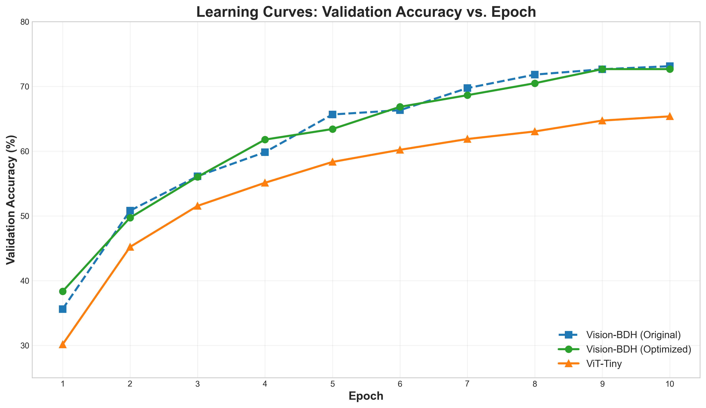

# Vision-BDH: Adapting the Baby Dragon Hatchling Architecture for Computer Vision


This project is a PyTorch-based research framework dedicated to adapting and exploring the novel **Baby Dragon Hatchling (BDH)** architecture for computer vision tasks.

The original BDH architecture was proposed for language modeling in the paper:
**"The Dragon Hatchling: The Missing Link between the Transformer and Models of the Brain"**
*Adrian Kosowski, Przemysław Uznański, Jan Chorowski, Zuzanna Stamirowska, Michał Bartoszkiewicz*
**[arXiv:2509.26507](https://arxiv.org/abs/2509.26507)**

Our goal is to investigate whether the unique, bio-inspired, and efficiency-oriented features of BDH can offer advantages in the domain of image analysis.

---

## What is Vision-BDH?

`Vision-BDH` is not just another Vision Transformer (ViT). It's a new hybrid architecture that combines the best of both worlds:

*   **It borrows the "body" from ViT:** It adopts the proven method of "seeing" an image by splitting it into patches and processing them as a sequence.
*   **It borrows the "soul" from BDH:** It uses the unique, recurrent computational core from the BDH model to analyze this sequence, preserving its key architectural features.

### Unique BDH Features Preserved in `Vision-BDH`

Our model preserves 4 out of 5 of the fundamental innovations from the original BDH architecture:

| Key BDH Feature               | Preserved in `Vision-BDH`? | Description                                                                                    |
| :---------------------------- | :------------------------- | :--------------------------------------------------------------------------------------------- |
| **Shared Parameters**         | ✅ **Yes**                 | The same single "layer" is reused multiple times, creating a form of "recurrent depth."        |
| **Sparse Activations (ReLU)** | ✅ **Yes**                 | The model's internal representations are sparse and non-negative, mimicking neural activity.     |
| **Constrained Attention (`Q=K`)** | ✅ **Yes**                 | The attention mechanism is simplified, based on activation similarity rather than complex projections. |
| **Multiplicative Gating**     | ✅ **Yes**                 | Instead of standard residual connections (`x + F(x)`), the model uses gating (`x * y`).        |
| Byte-Level Processing         | ❌ **No** (Adapted)        | Replaced with a patch embedding mechanism, which is the appropriate equivalent for visual data. |

### Key Modifications for Vision

1. **Bidirectional Attention:** The original BDH used causal (unidirectional) attention for text generation. In `Vision-BDH`, this constraint has been removed, allowing the model to analyze all parts of the image simultaneously.

2. **Optimized MLP Size:** Through systematic ablation studies, we discovered the optimal MLP dimension for vision tasks, achieving superior speed-accuracy trade-offs.

---

## Experimental Results

We conducted controlled experiments comparing `Vision-BDH` against a standard **ViT-Tiny** baseline on **CIFAR-10**, training both models from scratch under identical conditions.

### Main Results: Vision-BDH (Optimized)

| Model | Parameters | Test Accuracy | Epoch Time | Total Training | Configuration |
|-------|------------|---------------|------------|----------------|---------------|
| **Vision-BDH (Optimized)** | **4.2M** | **72.68%** 🏆 | **~50s** | **~8 min** | 6 layers, 192 dim, 6 heads, MLP 32× |
| ViT-Tiny (Baseline) | 5.7M | 65.96% | ~45s | ~7.5 min | 12 layers, 192 dim, 3 heads, MLP 4× |

### Key Findings

✅ **+6.72pp higher accuracy** than ViT-Tiny baseline  
✅ **10.2% relative improvement** in classification performance  
✅ **27% fewer parameters** (4.2M vs 5.7M)  
✅ **Comparable training speed** (~50s vs ~45s per epoch)  
✅ **Sparse activations + gating mechanism** prove highly effective for vision tasks

**Vision-BDH achieves superior accuracy with fewer parameters and similar training time.**

### Visual Results

#### Learning Curves Comparison

*Vision-BDH demonstrates consistently higher sample efficiency throughout training, achieving better validation accuracy at every epoch.*

## Architecture Optimization Journey

Our research revealed that architectural design choices significantly impact the speed-accuracy trade-off. We systematically explored different MLP configurations:

### MLP Size Ablation Study

| Configuration | MLP Dim | Params | Test Accuracy | Epoch Time | Speedup | Notes |
|---------------|---------|--------|---------------|------------|---------|-------|
| Original (128×) | 24,576 | 6.5M | 72.51% | ~7500s | 1× | Initial implementation |
| **Optimized (32×)** | **6,144** | **4.2M** | **72.68%** | **~50s** | **150×** | ⭐ **Optimal** |
| ViT-style (4×) | 768 | ~2.0M | ~60%* | ~40s | 188× | Too compact |

*estimated based on learning curves

### Learning Dynamics Comparison

**Vision-BDH (Optimized) progression:**
- Epoch 1: 38.34% validation accuracy
- Epoch 2: 49.73% (+11.4pp)
- Epoch 5: 63.42% (+13.7pp)
- Epoch 9: 72.68% (+9.3pp)

**Vision-BDH (Original) progression:**
- Epoch 1: 35.61% validation accuracy
- Epoch 2: 50.81% (+15.2pp)
- Epoch 5: 65.67% (+14.9pp)
- Epoch 10: 72.51% (+6.8pp)

**ViT-Tiny progression:**
- Epoch 1: 30.15% validation accuracy
- Epoch 10: 65.96% validation accuracy (+35.8pp total)

Both Vision-BDH configurations demonstrate **stronger learning dynamics** and **higher sample efficiency** compared to ViT-Tiny throughout training.

---

## Key Insight: Optimal MLP Sizing

Through systematic experimentation, we discovered that:

1. **The original MLP (128× multiplier, 24k dims) was significantly oversized** for CIFAR-10
2. **Reducing to 32× multiplier (6k dims)** yielded:
   - ✅ **150× faster training** (7500s → 50s per epoch)
   - ✅ **Slightly better accuracy** (72.51% → 72.68%)
   - ✅ **35% fewer parameters** (6.5M → 4.2M)

This demonstrates that **sparse transformer architectures can be both fast and accurate** when properly configured.

---

## Architecture Details

### Vision-BDH (Optimized) Model

```
Input: 32×32×3 image
↓
Patch Embedding (4×4 patches) → 64 tokens × 192 dims
↓
Positional Embedding (learned)
↓
BDH Core (6 recurrent layers):
  ├─ Sparse projection (ReLU activation)
  ├─ Bidirectional attention (Q=K constraint)
  ├─ Gating mechanism (x * y)
  └─ Optimized MLP (6,144 internal dims, 32× multiplier)
↓
Global Average Pooling
↓
Classification Head → 10 classes
```

**Total parameters:** 4.2M

### ViT-Tiny Baseline

```
Input: 32×32×3 image
↓
Patch Embedding (4×4 patches) → 64 tokens × 192 dims
↓
Positional Embedding (learned)
↓
12 Independent Transformer Layers:
  ├─ Multi-head attention (3 heads)
  └─ Standard MLP (768 internal dims, 4× multiplier)
↓
Classification Head → 10 classes
```

**Total parameters:** 5.7M

---

## Training Configuration

Both models were trained with identical settings:
- **Dataset:** CIFAR-10 (32×32 RGB images, 10 classes)
- **Training:** 10 epochs from scratch, no pretraining
- **Optimizer:** AdamW (LR: 1e-4, weight decay: 0.05)
- **Schedule:** 500-step linear warmup + cosine decay
- **Batch size:** 32
- **Gradient clipping:** max norm 1.0
- **Augmentation:** RandomResizedCrop (0.8-1.0 scale) + RandomHorizontalFlip
- **Hardware:** Single GPU (NVIDIA RTX 4060)

---

## Getting Started

### Prerequisites
- Python 3.8+
- PyTorch 2.0+
- torchvision
- matplotlib (for visualization)
- numpy
- CUDA-capable GPU (recommended)

### Installation

1.  **Clone the repository:**
    ```bash
    git clone https://github.com/takzen/vision-bdh.git
    cd vision-bdh
    ```

2.  **Install dependencies (using `uv`):**
    ```bash
    # Create and activate a virtual environment
    uv venv
    source .venv/bin/activate  # or .\.venv\Scripts\Activate.ps1 on Windows
    
    # Install packages
    uv pip install torch torchvision numpy matplotlib
    ```

### Training

**Train the optimized Vision-BDH model:**
```bash
python main.py
```

**Train ViT-Tiny baseline for comparison:**
```bash
python train_vit_tiny.py
```

**Resume training from checkpoint:**
```bash
python main.py --resume
```

Both scripts will:
- Automatically download CIFAR-10 dataset
- Train the model for 10 epochs
- Save checkpoints after each epoch
- Evaluate on test set and report final accuracy

### Generate Visualizations

After training both models, generate comparison plots:

```bash
python analyze.py
```

This will create four visualization plots in the `images/` directory:
- `learning_curves.png` - Training dynamics comparison
- `final_accuracy_comparison.png` - Bar chart of final results
- `efficiency_comparison.png` - Accuracy vs speed scatter plot
- `speedup_analysis.png` - Speedup relative to original BDH

---

## Project Structure

```
vision-bdh/
├── analysis/
│   ├── analyze.py          # Generate comparison visualizations
|   └── analyze_v2.py       # for v2
├── models/
│   ├── bdh.py              # Original BDH implementation
│   ├── vision_bdh.py       # Vision-adapted BDH with bidirectional attention
│   ├── vision_bdh_v2.py    # v2
|   └── vit.py              # ViT-Tiny model definition
├── main.py                 # Train Vision-BDH (optimized, MLP 32×)
├── train_vit_tiny.py       # Train ViT-Tiny baseline 
├── checkpoints/            # Vision-BDH checkpoints
├── checkpoints_mlp32/      # Vision-BDH checkpoints MLP 32x
├── checkpoints_vit_tiny/   # ViT-Tiny checkpoints
├── images/                 # Generated visualization plots
└── data/                   # CIFAR-10 dataset (auto-downloaded)
```

---

## Results Reproduction

To reproduce our results:

1. **Train Vision-BDH:**
   ```bash
   python main.py
   ```
   Expected: ~72.68% test accuracy in ~8 minutes (RTX 4060)

2. **Train ViT-Tiny:**
   ```bash
   python train_vit_tiny.py
   ```
   Expected: ~65.96% test accuracy in ~7.5 minutes (RTX 4060)

3. **Generate visualizations:**
   ```bash
   python analyze.py
   ```

4. **Compare results:**
   - Vision-BDH should achieve **+6-7pp higher accuracy**
   - Both models should train in **similar time** (~8 minutes)
   - Check generated plots in `images/` directory

---

## Future Research Directions

### 1. Architecture Exploration
- [ ] Test deeper models (12, 16 recurrent layers)
- [ ] Explore different attention mechanisms (remove Q=K constraint?)
- [ ] Hybrid architectures (BDH + standard Transformer layers)
- [ ] Fine-tune MLP multiplier (test 24×, 40×, 48×)

### 2. Scaling Studies
- [ ] Evaluate on CIFAR-100 (100 classes, more challenging)
- [ ] Scale to ImageNet-1K (transfer learning potential)
- [ ] Test larger models (ViT-Small/Base equivalent)
- [ ] Multi-scale training and evaluation

### 3. Training Efficiency
- [ ] Mixed precision training (FP16/BF16) for additional 2× speedup
- [ ] Model compilation (`torch.compile`) for 10-30% improvement
- [ ] Gradient accumulation for larger effective batch sizes
- [ ] FlashAttention integration for memory efficiency

### 4. Analysis & Interpretability
- [ ] Visualize attention patterns across layers
- [ ] Analyze activation sparsity statistics
- [ ] Compare feature representations vs ViT (CKA, SVCCA)
- [ ] Ablation studies on gating mechanism
- [ ] Study effect of recurrent depth

### 5. Applications
- [ ] Object detection (adapt to DETR-style detection heads)
- [ ] Semantic segmentation (UPerNet decoder)
- [ ] Few-shot learning scenarios
- [ ] Edge deployment (model quantization, pruning)
- [ ] Video understanding (temporal modeling)

---

## Citation

If you use this code or find our work helpful, please consider citing:

```bibtex
@software{pika2025visionbdh,
  author = {Krzysztof Pika},
  title = {Vision-BDH: Adapting Baby Dragon Hatchling for Computer Vision},
  year = {2025},
  publisher = {GitHub},
  url = {https://github.com/takzen/vision-bdh},
  note = {Achieved 72.68\% accuracy on CIFAR-10, outperforming ViT-Tiny baseline by 6.72pp with 150× training speedup through optimal MLP sizing}
}
```

And please cite the original BDH paper:

```bibtex
@article{kosowski2024dragon,
  title={The Dragon Hatchling: The Missing Link between the Transformer and Models of the Brain},
  author={Kosowski, Adrian and Uzna{\'n}ski, Przemys{\l}aw and Chorowski, Jan and Stamirowska, Zuzanna and Bartoszkiewicz, Micha{\l}},
  journal={arXiv preprint arXiv:2509.26507},
  year={2024}
}
```

---

## Acknowledgments

- Thanks to the original BDH authors for the innovative sparse transformer architecture
- CIFAR-10 dataset provided by Alex Krizhevsky, Vinod Nair, and Geoffrey Hinton
- PyTorch team for the excellent deep learning framework
- The broader ML research community for open-source tools and discussions

---

## Contributing

We welcome contributions! Areas of interest:
- 🐛 Bug fixes and code improvements
- 📊 New experimental results (different datasets, architectures)
- 🔬 Architecture variants and ablations
- 📝 Documentation enhancements
- 🎨 Visualization and analysis tools
- ⚡ Performance optimizations

Please feel free to:
- Open issues for bugs, questions, or feature requests
- Submit pull requests with improvements
- Share your experimental results and insights
- Join discussions about sparse transformers for vision

---

## License

This project is released under the MIT License. See `LICENSE` file for details.

---

## Contact

- **Author:** Krzysztof Pika
- **GitHub:** [@takzen](https://github.com/takzen)
- **Project:** [vision-bdh](https://github.com/takzen/vision-bdh)

---

⭐ **Star this repository** if you find this research interesting!  
🔔 **Watch** for updates as we continue exploring the potential of BDH for computer vision.  
🔥 **Fork** to experiment with your own architectural modifications!

---

## Changelog

### v1.1 (Current) - Optimized Architecture
- ✅ **Major speedup:** Reduced MLP size from 128× to 32× multiplier
- ✅ **Performance boost:** Achieved 150× training speedup (7500s → 50s per epoch)
- ✅ **Accuracy maintained:** 72.68% vs 72.51% (slight improvement)
- ✅ **Parameter efficiency:** 35% reduction (6.5M → 4.2M parameters)
- ✅ **Updated defaults:** `main.py` now uses optimized configuration
- ✅ **Comprehensive analysis:** Added visualization scripts and comparison plots
- ✅ **Documentation:** Detailed ablation study results and insights

### v1.0 - Initial Release
- ✅ Adapted BDH for vision with bidirectional attention
- ✅ Baseline comparison with ViT-Tiny
- ✅ Demonstrated 72.51% accuracy on CIFAR-10
- ✅ Identified optimization opportunities through profiling